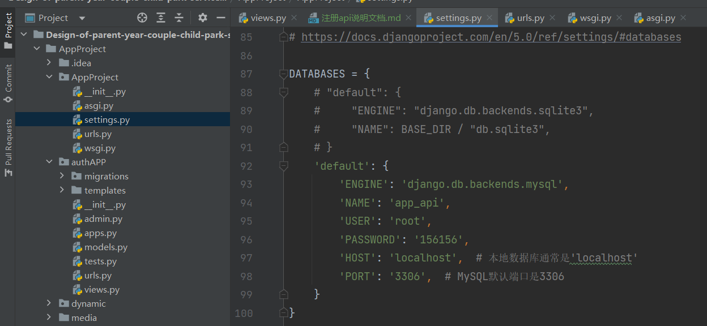

# 注册功能实现
## API文档请求模板

### 1. API概述
- **功能描述**：实现用户注册功能。用户通过提供用户名、电子邮件和密码来注册账户。

### 2. API端点
- **URL**：`http://127.0.0.1:8000/authAPP/register/`
- **方法**：POST

### 3. 请求参数
- **路径参数**：无
- **查询参数**：无

### 4. 请求体
- **格式**：JSON
- **内容**：
  - `username` (String, 必需)：用户的用户名。
  - `email` (String, 必需)：用户的电子邮件地址。
  - `password` (String, 必需)：用户的密码。

### 5. 响应体（请求后，后端传回来的数据）
- **成功响应**：
  - **状态码**：200
  - **内容**：`{"message": "User registered successfully"}`
- **错误响应**：
  - **状态码**：400
  - **内容**：
    - 如果缺少必要信息：`{"error": "Please provide username, email, and password"}`
    - 如果用户名已存在：`{"error": "Username already exists"}`

### 6. 示例
- **请求示例**：
  ```json
  POST /authAPP/register/
  Content-Type: application/json

  {
    "username": "newuser",
    "email": "newuser@example.com",
    "password": "securepassword123"
  }
  ```
- **响应示例**：
  - **成功示例**：
    ```json
    {
      "message": "User registered successfully"
    }
    ```
  - **错误示例**（缺少信息）：
    ```json
    {
      "error": "Please provide username, email, and password"
    }
    ```
  - **错误示例**（用户名已存在）：
    ```json
    {
      "error": "Username already exists"
    }
    ```

### 7. 特殊说明
- **认证方式**：无
- **限制与注意事项**：
  - 后端已实现逻辑:确保使用唯一的用户名进行注册，以避免`"Username already exists"`错误。
  - 本地运行时要把数据库修改为你自己的。看图片下的文件
